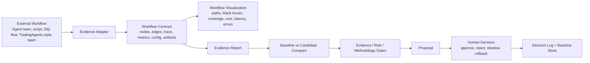

# Loop Harness

**Evidence-driven control layer for external AI workflows**

[](https://github.com/Lemonseaa/loop-harness)
[](https://www.python.org/)
[](https://www.docker.com/)
[](LICENSE)

Loop Harness connects to external Agent teams, automation workflows, and business processes, then turns their runs and changes into evidence humans can inspect, compare, approve, reject, or roll back.

It is not a low-code workflow builder, Agent runtime replacement, Dify clone, Nexent clone, or TradingAgents clone. Its job is narrower and more valuable: **prove whether a workflow change actually improved outcomes.**

## Why It Exists

AI workflows are easy to build and hard to trust. A workflow can look busy, generate polished output, and still fail to prove that it improved anything.

Loop Harness adds the missing control layer around those workflows:

- **Visualize** what the workflow did.
- **Measure** whether key metrics changed.
- **Compare** candidates against baselines.
- **Gate** weak evidence, high risk, and human methodology mismatches.
- **Record** decisions and rollback paths.

## Core Flow



## License

Loop Harness is source-available for non-commercial use. Commercial use requires prior written authorization. See [LICENSE](LICENSE).

Commercial authorization contact: liminxi634@163.com

## Positioning

```text
Dify / Nexent / Archon / LangGraph / TradingAgents = workflow execution or workflow templates
Loop Harness = evidence harness + workflow visualization + review layer + approval layer + rollback layer
```

The authoritative roadmap is [docs/BLUEPRINT.md](docs/BLUEPRINT.md).

## Core Question

```text
Can I prove whether an external workflow change made things better, worse, or inconclusive?
```

If the answer is yes, Loop Harness is useful.

## What Loop Harness Does

- Ingests external workflow runs through an Evidence Adapter.
- Normalizes workflow contracts, traces, configs, artifacts, and metrics.
- Visualizes imported workflow structure, run paths, black-box nodes, trace coverage, metric coverage, cost, latency, and errors.
- Records experiments with hypothesis, baseline, change, result, and conclusion.
- Compares prompt / strategy / workflow / model / tool-policy versions against baselines.
- Runs shadow or replay checks before humans accept changes.
- Applies evidence, risk, and methodology gates before approval.
- Produces evidence reports that support approve / reject / rollback decisions.

## When To Use It

Use Loop Harness when:

- You already have, or plan to build, an external AI workflow.
- You need to see what happened inside a workflow run.
- You need baseline-vs-candidate comparisons before accepting changes.
- You care about evidence quality, risk, rollback, and human decision records.
- You want to improve quant research, content operations, or other workflows through repeated measurable experiments.

## What Loop Harness Does Not Do

- It does not provide a drag-and-drop workflow builder.
- It does not replace Dify as a prototyping tool.
- It does not depend on Dify as the final execution layer.
- It does not blindly fork TradingAgents or any external framework.
- It does not optimize fully black-box workflows that expose no trace, metrics, or configurable surface.
- It does not automatically deploy live trading, publish content, delete history, or bypass human final control.
- It does not build a full plugin marketplace or full model provider platform.
- It does not promise automatic profit, automatic followers, or real learning from tiny samples.

## When Not To Use It

Do not use Loop Harness when:

- You only need a quick prototype workflow.
- Your workflow cannot expose trace, metrics, or configurable surfaces.
- You expect automatic trading profit or automatic content growth without enough feedback data.
- You want a full enterprise orchestration platform.

## Main Concepts

| Concept | Meaning |
|---|---|
| BusinessLine | A top-level business/domain boundary for lifecycle, budgets, isolation, and reporting. |
| Scenario | A bounded optimization domain, such as quant research or media growth. |
| EvidenceAdapter | Ingests external workflow run JSON and normalizes it into Loop Harness evidence. |
| WorkflowContract | The structured interface that exposes a workflow's nodes, edges, inputs, outputs, metrics, and configurable surfaces. |
| WorkflowVisualization | Diagnostic map of imported workflows: nodes, run paths, black boxes, coverage, risk, cost, latency, and errors. |
| Experiment | A recorded attempt to improve behavior, with hypothesis and result. |
| Run | One execution of an Agent team or business workflow. |
| Trace | Structured record of each Agent step, tool call, parameter, and output. |
| Baseline | The current version or benchmark used for comparison. |
| Candidate | A proposed workflow/config/strategy version compared against a baseline. |
| Shadow / Replay | Test a candidate version before humans accept it. |
| Evidence Gate | Blocks recommendations when data is not strong enough. |
| Risk Gate | Decides whether a change is automatic, approval-required, or blocked. |
| Methodology Profile | Human-owned preferences, standards, risk boundaries, style, and decision rules. |

## Intended Business Teams

```text
Quant Team:
TradingAgents-style research roles + data/backtest/risk tools + Loop Harness experiment control

Media Team:
trend/content/publishing/traffic-feedback agents + Loop Harness experiment control

Workflow Team:
external automation or Agent workflow + Loop Harness evidence adapter + workflow visualization + report + decision log
```

## Quick Start

```bash
pip install -e .
loopharness status
```

Evidence harness example:

```bash
loopharness evidence ingest examples/evidence/quant_baseline_run.json
loopharness evidence ingest examples/evidence/quant_candidate_run.json
loopharness evidence visualize --run quant_candidate_001
loopharness evidence compare --baseline quant_baseline_001 --candidate quant_candidate_001
loopharness evidence report --run quant_candidate_001
```

Python API:

```python
from loop_harness import EvidenceHarness

harness = EvidenceHarness(".runtime/evidence.db")
harness.ingest_file("examples/evidence/quant_baseline_run.json")
harness.ingest_file("examples/evidence/quant_candidate_run.json")
report = harness.compare("quant_baseline_001", "quant_candidate_001")
print(report.recommendation)
```

HTTP API:

```text
POST /api/evidence/runs
GET  /api/evidence/runs?workflow_id=...
GET  /api/evidence/runs/{run_id}/visualization
GET  /api/evidence/runs/{run_id}/report
POST /api/evidence/compare
```

Quant drill example:

```bash
loopharness evidence quant-drill --candidates 30 --comparisons 5
```

This creates a deterministic semi-real historical drill: one baseline, thirty candidate
runs, five baseline/candidate comparisons, workflow visualization data, and a paper-trade
recommendation. It validates the evidence chain; it is not a live trading signal.

Docker:

```bash
cp .env.example .env
docker compose up -d
docker compose ps
```

## Development

```bash
python -m unittest discover -s tests -v
python -m ruff check loop_harness tests scripts
python -m mypy loop_harness --show-error-codes --no-incremental
```

Repository structure:

```text
loop_harness/evidence/        Mainline Evidence Harness code.
docs/core_innovation/          Loop Harness-owned product ideas.
docs/borrowed_wheels/          External wheels and replacement strategy.
docs/business_lines/           Quant, content, and demo domain docs.
tests/evidence/                Mainline evidence tests.
tests/business_lines/quant/    Quant validation tests.
tests/support/                 Support module regression tests.
tests/legacy/                  Historical compatibility tests.
examples/evidence/             Evidence input examples.
examples/support/              Current support examples.
scripts/ops/                   Operational scripts.
scripts/business_lines/quant/  Quant business-line scripts.
```

## Documentation

- [Docs Index](docs/README.md): where each kind of document belongs.
- [Blueprint](docs/BLUEPRINT.md): current source of truth.
- [Strategic Reset Plan](docs/STRATEGIC_RESET_PLAN.md): current execution plan.
- [Core Innovation](docs/core_innovation/README.md): evidence harness, workflow visualization, metric schema, and human methodology.
- [Core Innovation Thesis](docs/core_innovation/CORE_INNOVATION.md): what Loop Harness owns and why.
- [Borrowed Wheels](docs/borrowed_wheels/README.md): external projects, replacement wheels, and adapter compatibility.
- [Wheel Strategy](docs/borrowed_wheels/WHEEL_STRATEGY.md): what to reuse, borrow, own, or connect.
- [Business Lines](docs/business_lines/README.md): quant, content, and temporary demo applications.
- [Legacy Replacement Matrix](docs/borrowed_wheels/legacy_replacement_matrix.md): replacement, rewrite, keep, and isolation decisions for old modules.
- [System Boundaries](docs/SYSTEM_BOUNDARIES.md): policy and BusinessLine/Scenario boundaries.
- [Risk Review](docs/RISK_REVIEW.md): risks that would pull the project back into duplicated platform work.
- [Archive](docs/archive/README.md): historical architecture and research references.
